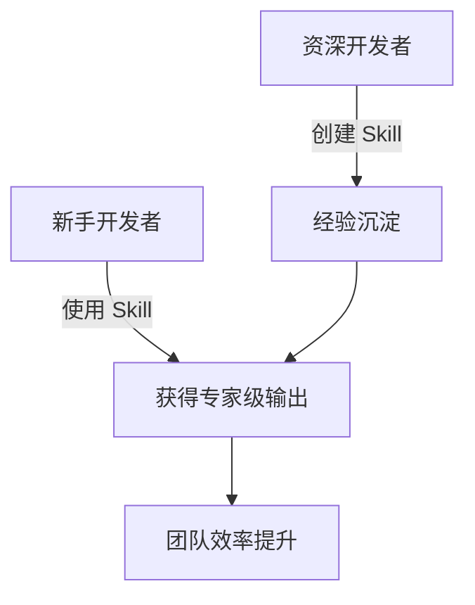
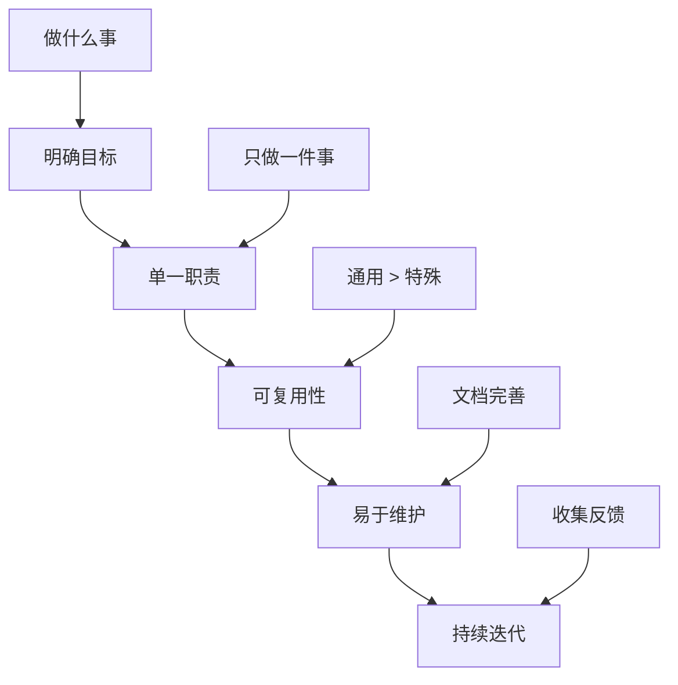

# Claude Cowork Skill 功能介绍

## 📖 目录
1. [诞生背景](#诞生背景)
2. [什么是 Skill](#什么是-skill)
3. [核心优势](#核心优势)
4. [使用方法](#使用方法)
5. [开发者实践](#开发者实践)
6. [创建自定义 Skill](#创建自定义-skill)

---

## 🎯 诞生背景

### 问题场景
在 AI 辅助开发过程中，我们经常遇到以下挑战：

```
❌ 问题 1: 重复劳动
   开发者每次都要向 AI 解释相同的最佳实践

❌ 问题 2: 质量不稳定
   同样的任务，不同时候输出质量差异大

❌ 问题 3: 知识碎片化
   团队的最佳实践难以沉淀和复用
```

### 解决方案
**Skill** 应运而生 —— 将专业知识、工作流程、最佳实践打包成可复用的能力模块。


---

## 🔧 什么是 Skill

Skill 是 **可复用的专业能力包**，它包含：

| 组成部分 | 说明 | 示例 |
|---------|------|------|
| **知识库** | 领域专业知识和最佳实践 | Python 代码规范、API 设计模式 |
| **工作流** | 结构化的任务执行步骤 | 测试驱动开发流程 |
| **工具集成** | 预配置的开发工具 | linter、formatter、测试框架 |
| **模板** | 可直接使用的代码模板 | 项目脚手架、配置文件 |

### Skill 工作原理

```
┌─────────────┐
│  用户请求   │  "帮我创建一个 MCP server"
└──────┬──────┘
       │
       ▼
┌─────────────┐
│ Skill 激活  │  触发 mcp-builder skill
└──────┬──────┘
       │
       ▼
┌─────────────┐
│ 加载知识库  │  • MCP 协议规范
└──────┬──────┘  • FastMCP 最佳实践
       │          • 常见模式和陷阱
       ▼
┌─────────────┐
│ 执行工作流  │  1. 分析需求
└──────┬──────┘  2. 选择框架
       │          3. 生成代码
       │          4. 配置环境
       │          5. 测试验证
       ▼
┌─────────────┐
│ 输出结果    │  高质量 MCP server
└─────────────┘
```

---

## 💎 核心优势

### 1. **一致性保证**
```python
# 没有 Skill：每次输出可能不同
"创建一个 API" → 可能得到 REST / GraphQL / RPC

# 使用 Skill：遵循团队标准
"创建一个 API" → 严格按照团队的 REST API 规范
```

### 2. **知识复用**
```
传统方式:  每个开发者 × 重复学习成本 = N × 时间
Skill 方式: 一次封装 + 全员共享 = 1 × 时间
```

### 3. **降低门槛**


### 4. **持续改进**
- ✅ Skill 可以版本管理
- ✅ 接收反馈后快速迭代
- ✅ 最佳实践自动同步给所有用户

---

## 🚀 使用方法

### 基础用法

#### 1️⃣ 查看可用 Skill
```bash
# 在 Claude Cowork 中，可用的 skill 会自动列出
# 当你的请求匹配某个 skill 时，它会自动激活
```

#### 2️⃣ 隐式触发（推荐）
```
用户: "帮我创建一个 MCP server 用于集成 GitHub API"
     ↓
Claude 自动识别并激活 mcp-builder skill
```

#### 3️⃣ 显式调用
```
用户: "/mcp-builder"
     或
用户: "使用 mcp-builder skill 帮我..."
```

### 触发关键词

| Skill | 触发词 | 示例 |
|-------|--------|------|
| **mcp-builder** | MCP server, MCP 集成, 工具集成 | "创建一个 MCP server" |
| **skill-creator** | 创建 skill, 自定义能力 | "我想创建一个新 skill" |
| **doc-coauthoring** | 写文档, 技术规范, RFC | "帮我写技术设计文档" |
| **web-artifacts-builder** | React 组件, Web 应用 | "创建一个仪表板页面" |

---

## 👨‍💻 开发者实践

### 实践 1: 使用 MCP Builder 快速集成外部服务

**场景**: 需要让 Claude 访问公司内部的 Jira 系统

```python
# 用户请求
"帮我创建一个 MCP server，集成我们的 Jira API，
需要能够查询 issue、创建 issue、更新状态"

# mcp-builder skill 自动执行：

# 1. 生成项目结构
my-jira-mcp/
├── src/
│   └── server.py          # FastMCP server
├── pyproject.toml          # 依赖配置
└── README.md              # 使用文档

# 2. 实现核心功能
from fastmcp import FastMCP
import httpx

mcp = FastMCP("Jira Integration")

@mcp.tool()
async def get_issue(issue_key: str) -> dict:
    """获取 Jira issue 详情"""
    # 自动包含错误处理、重试逻辑等最佳实践
    ...

@mcp.tool()
async def create_issue(project: str, summary: str,
                       description: str) -> dict:
    """创建新的 Jira issue"""
    ...

# 3. 生成配置文件
# 4. 提供测试代码
# 5. 创建部署说明
```

**优势**:
- ✅ 5 分钟完成通常需要 1 小时的工作
- ✅ 自动遵循 MCP 协议最佳实践
- ✅ 内置错误处理和日志记录
- ✅ 开箱即用的测试框架

---

### 实践 2: 使用 Skill Creator 沉淀团队知识

**场景**: 团队有特定的微服务开发规范

```markdown
# 用户请求
"帮我创建一个 skill，用于生成符合我们团队规范的微服务"

# skill-creator 引导你完成：

## 步骤 1: 定义 Skill 范围
- 名称: team-microservice-generator
- 触发词: "创建微服务", "新建服务"
- 输出: Go 微服务项目

## 步骤 2: 编写知识库
SKILL.md 内容包括:
- 团队的目录结构标准
- API 设计规范（RESTful 约定）
- 错误处理模式
- 日志格式
- 配置管理方式
- Docker 镜像构建标准

## 步骤 3: 添加模板文件
templates/
├── main.go.template
├── Dockerfile.template
├── k8s/deployment.yaml.template
└── README.md.template

## 步骤 4: 测试验证
使用真实场景测试 skill 效果
```

**收益**:
```
第一次创建微服务: 2 小时（学习规范 + 编码）
使用 Skill 后:      5 分钟（生成 + 微调）

10 个微服务的时间节省: 15+ 小时
```

---

### 实践 3: Doc Coauthoring - 结构化文档协作

**场景**: 撰写技术设计文档 (Technical Design Doc)

```
用户: "帮我写一个关于分布式缓存系统的技术设计文档"

# doc-coauthoring skill 提供结构化流程:

Phase 1: 上下文收集
┌─────────────────────────────────┐
│ • 项目背景是什么？              │
│ • 目标读者是谁？                │
│ • 有哪些技术约束？              │
│ • 现有系统架构如何？            │
└─────────────────────────────────┘

Phase 2: 文档框架生成
┌─────────────────────────────────┐
│ # 分布式缓存系统设计            │
│                                 │
│ ## 1. 背景与目标                │
│ ## 2. 需求分析                  │
│ ## 3. 技术方案                  │
│ ## 4. 架构设计                  │
│ ## 5. 接口定义                  │
│ ## 6. 数据模型                  │
│ ## 7. 部署方案                  │
│ ## 8. 监控与运维                │
│ ## 9. 风险与应对                │
│ ## 10. 时间规划                 │
└─────────────────────────────────┘

Phase 3: 迭代完善
逐节深入编写，确保:
✓ 技术细节准确
✓ 架构图清晰
✓ 决策有依据
✓ 风险已评估

Phase 4: 读者验证
生成验证清单，确保文档可用性
```

---

## 🛠 创建自定义 Skill

### 快速开始

```bash
# 1. 使用 skill-creator 引导创建
用户: "我想创建一个 skill 用于生成 Python 数据处理脚本"

# 2. Skill 基本结构
my-custom-skill/
├── SKILL.md              # 核心：技能说明书
├── templates/            # 代码/配置模板（可选）
├── examples/             # 示例代码（可选）
└── README.md            # 使用说明

# 3. SKILL.md 关键内容
---
name: python-data-processor
description: 生成数据处理脚本的专家
triggers:
  - "数据处理"
  - "ETL"
  - "数据清洗"
---

## 专业知识
- Pandas 最佳实践
- 数据验证模式
- 性能优化技巧
- 错误处理策略

## 工作流
1. 分析数据源格式
2. 设计处理流程
3. 生成代码
4. 添加日志和错误处理
5. 提供测试用例

## 代码模板
[包含常用的数据处理模式]
```

### Skill 设计原则



### 优秀 Skill 的特征

| 特征 | 说明 | 例子 |
|------|------|------|
| **明确触发** | 清晰的关键词和使用场景 | "创建 MCP" → mcp-builder |
| **完整知识** | 包含完整的最佳实践 | 不只是代码，还有架构考虑 |
| **实用模板** | 提供可直接使用的模板 | 项目脚手架、配置文件 |
| **清晰流程** | 结构化的执行步骤 | 分析→设计→实现→测试 |
| **持续改进** | 根据反馈不断优化 | 版本控制、更新日志 |

---

## 🎓 总结

### 核心要点
```
┌─────────────────────────────────────────┐
│  Skill = 专业知识 + 工作流 + 工具       │
│                                         │
│  • 封装最佳实践，保证输出质量           │
│  • 降低使用门槛，新手获得专家能力       │
│  • 知识可复用，避免重复劳动             │
│  • 持续迭代，越用越好                   │
└─────────────────────────────────────────┘
```

### 开发者价值

```python
# 效率提升
time_saved = 传统方式时间 - Skill方式时间
quality_improvement = Skill输出质量 / 手动质量

# 实际数据
average_time_saved_per_task = "60-80%"
consistency_rate = "95%+"
onboarding_time_reduction = "70%+"
```

### 下一步行动

1. **使用现有 Skill**: 尝试 mcp-builder、doc-coauthoring
2. **创建团队 Skill**: 沉淀你们的最佳实践
3. **分享和改进**: 在团队内推广，收集反馈迭代

---

## 📚 参考资源

- [Skill Creator 指南](https://docs.claude.ai/skills)
- [MCP Builder 文档](https://modelcontextprotocol.io)
- [Claude Cowork 官方文档](https://claude.ai/cowork)

---

**提问时间**: 欢迎提问和讨论！ 🙋‍♂️
