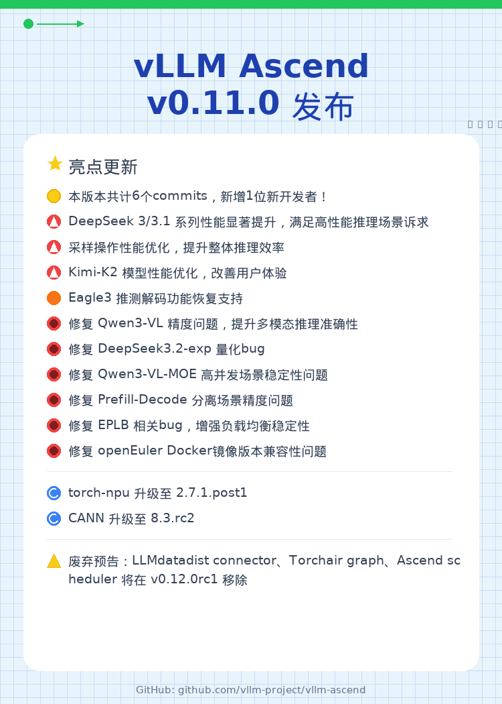
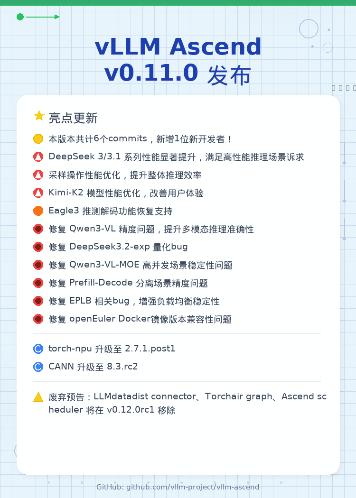
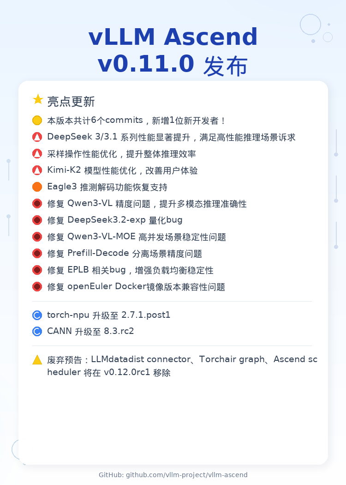

# 与 Claude 协作制作 Release 宣传长图：完整交互记录

> 本文档记录了我与 Claude AI 协作完成 vLLM Ascend v0.11.0 宣传长图的完整过程，展示如何通过多轮对话迭代优化设计成果。

---

## 📋 目录

1. [任务启动](#1-任务启动)
2. [提供参考素材](#2-提供参考素材)
3. [首版设计生成](#3-首版设计生成)
4. [第一次优化：增加科技感](#4-第一次优化增加科技感)
5. [第二次优化：简化设计](#5-第二次优化简化设计)
6. [封装为可复用 Skill](#6-封装为可复用-skill)
7. [协作心得与技巧](#7-协作心得与技巧)

---

## 1. 任务启动

### 💬 我的需求

> 这是一篇有关vllm-ascend项目发布的Release宣传微信文章，包含宣传长图和文字内容，请帮我按照这个风格生成一篇vllm-ascend v0.11.0 的宣传文章，vllm-ascend的仓库地址是 https://github.com/vllm-project/vllm-ascend

### 🤖 Claude 的响应

Claude 首先识别出需要两部分信息：
1. **参考文章的风格** - 需要我提供样例
2. **v0.11.0 的发布内容** - 可以从 GitHub 获取

Claude 主动去 GitHub 获取了 v0.11.0 的 release notes，整理出核心更新内容：

| 分类 | 内容 |
|------|------|
| 发布日期 | 2024年12月16日 |
| 性能提升 | DeepSeek 3/3.1、采样性能、Kimi-K2 |
| 功能恢复 | Eagle3 推测解码 |
| Bug修复 | Qwen3-VL精度、量化bug、高并发稳定性等 |
| 依赖升级 | CANN 8.3.RC2、torch-npu 2.7.1.post1 |

**💡 技巧：给 Claude 提供明确的信息来源（如 GitHub 链接），它会主动获取所需数据。**

---

## 2. 提供参考素材

### 💬 我的操作

由于微信文章链接无法直接访问，我上传了参考图片：


### 🤖 Claude 的分析

Claude 收到图片后，立即分析出设计要素：

- **背景**：浅蓝色格子纹理
- **装饰**：顶部绿色条 + 左上角圆点箭头
- **布局**：白色圆角卡片
- **内容格式**：emoji + 文字列表
- **分类图标**：🎊统计 🚀性能 🔥功能 🐞修复 🔄更新 ⚠️警告

**💡 技巧：直接上传参考图比文字描述更高效，Claude 能精准捕捉视觉细节。**

---

## 3. 首版设计生成

### 🤖 Claude 的工作过程

Claude 创建了任务清单并逐步执行：

```
☑️ 获取 v0.11.0 完整 release notes
☑️ 分析参考图风格并准备内容结构
⏳ 制作 v0.11.0 宣传长图
⏳ 编写微信文章文案
```

### 🔧 技术方案探索（真实的试错过程）

Claude 最初的方案是**先生成 HTML，再截图转 PNG**。但这一路遇到了不少障碍：

#### 尝试 1：Puppeteer ❌

```bash
npm install puppeteer
```

**失败原因**：Chrome 下载失败（403 错误），服务器无法访问 Google 的 CDN

```
Error: ERROR: Failed to set up chrome v144.0.7559.96!
Got status code 403
```

#### 尝试 2：Playwright ❌

```bash
pip install playwright && python -m playwright install chromium
```

**失败原因**：安装超时（3分钟后中断），包体积太大

```
Exit code 143 - Command timed out after 3m 0s
Downloading playwright-1.58.0-py3-none-manylinux... (46.0 MB)
```

#### 尝试 3：wkhtmltopdf ❌

```bash
apt-get install -y wkhtmltopdf
```

**失败原因**：没有 root 权限

```
E: Could not open lock file - Permission denied
E: Unable to lock directory /var/lib/apt/lists/
```

#### 尝试 4：html2image ❌

```python
from html2image import Html2Image
hti = Html2Image()
hti.screenshot(url='file:///path/to/file.html', save_as='output.png')
```

**失败原因**：依赖 Chrome，而系统没有安装

```
FileNotFoundError: Could not find a Chrome executable on this machine
```

#### 最终方案：Pillow 直接绘制 ✅

经过4次失败后，Claude 改变策略，不再依赖浏览器截图，而是用 **Python Pillow 库直接绑制图片**：

```python
from PIL import Image, ImageDraw, ImageFont

img = Image.new('RGBA', (750, 1050), background_color)
draw = ImageDraw.Draw(img)
# 直接绑制所有元素...
img.save('output.png')
```

**💡 启示：遇到障碍时，Claude 会自动寻找替代方案，而非停滞不前。**

---

### 🔤 字体渲染问题的解决

用 Pillow 直接绘制后，又遇到了新问题：

#### 问题 1：Emoji 显示为方块

第一版代码直接使用 emoji 字符：

```python
draw.text((x, y), "🚀 性能提升", font=font)
```

**结果**：系统字体不支持 emoji，显示为 □□□

**解决方案**：用几何图形模拟图标

```python
def draw_icon(x, y, icon_type):
    if icon_type == "rocket":
        # 红色圆形 + 白色三角形
        draw.ellipse([...], fill=(239, 68, 68))
        draw.polygon([...], fill=WHITE)
```

#### 问题 2：英文显示为方块

修复 emoji 后，发现英文也显示异常：

```
□□□□ Ascend v0.11.0 发布
```

**原因**：中文字体 `DroidSansFallbackFull.ttf` 不完整支持拉丁字母

**解决方案**：中英文使用不同字体，逐字符判断并渲染

```python
CN_FONT = 'DroidSansFallbackFull.ttf'  # 中文
EN_FONT = 'DejaVuSans.ttf'              # 英文

def is_chinese(char):
    return '\u4e00' <= char <= '\u9fff'

def draw_mixed_text(text):
    for char in text:
        font = CN_FONT if is_chinese(char) else EN_FONT
        draw.text((x, y), char, font=font)
```

---

### 📊 问题解决汇总

| 问题 | 尝试方案 | 结果 | 最终解决 |
|------|----------|------|----------|
| HTML→PNG | Puppeteer | ❌ Chrome下载失败 | 改用Pillow |
| HTML→PNG | Playwright | ❌ 安装超时 | 改用Pillow |
| HTML→PNG | wkhtmltopdf | ❌ 无root权限 | 改用Pillow |
| HTML→PNG | html2image | ❌ 缺少Chrome | 改用Pillow |
| Emoji方块 | 直接使用emoji | ❌ 字体不支持 | 几何图形模拟 |
| 英文方块 | 单一中文字体 | ❌ 不支持拉丁字母 | 混合字体渲染 |

### 📸 首版效果



*第一版：完全复刻参考图风格，包含格子背景、绿色装饰条、白色卡片*

**💡 技巧：Claude 会自动处理技术障碍，用户无需关心实现细节。但了解这个过程有助于理解 AI 的工作方式——它会不断尝试，直到找到可行方案。**

---

## 4. 第一次优化：增加科技感

### 💬 我的反馈

> 底色背景看起来有些单调，能否增加一些更为科技感的元素，但是不要太花

### 🤖 Claude 的调整

Claude 理解了"科技感但不花哨"的平衡要求，添加了：

- ✅ **渐变光晕** - 右上角蓝色、左下角绿色的淡淡光晕
- ✅ **装饰性圆圈** - 角落的空心/实心圆点组合
- ✅ **侧边线条** - 两侧的短线+圆点装饰
- ✅ **卡片阴影** - 柔和的投影效果

### 📸 优化后效果



*第二版：增加科技感装饰（光晕、圆圈、线条），但仍保留格子背景*

**💡 技巧：用"但是"句式给出约束条件，帮助 Claude 把握设计尺度。**

---

## 5. 第二次优化：简化设计

### 💬 我的反馈

> 背景不需要方格，顶层的绿色条及箭头也没有必要，请再整体优化一下

### 🤖 Claude 的调整

Claude 进行了减法设计：

| 移除 | 替代方案 |
|------|----------|
| 方格背景 | 柔和的蓝白渐变 |
| 绿色装饰条 | 无（更简洁） |
| 左上角箭头 | 无（更简洁） |

同时保留了科技感元素（光晕、圆圈、线条）。

### 📸 最终效果



*最终版：移除格子和绿色装饰条，改用柔和渐变背景，保留科技感元素*

**设计特点：**
- 干净的渐变背景
- 恰到好处的科技装饰
- 清晰的信息层次
- 专业的整体观感

**💡 技巧：明确指出要删除的元素，比描述想要什么更直接有效。**

---

## 6. 封装为可复用 Skill

### 💬 我的需求

> 请将生成这个风格海报的过程保存为一个 skill

### 🤖 Claude 的工作

#### 第一步：学习 Skill 规范

Claude 首先阅读了 `skill-creator` 的 SKILL.md 文件，了解 Skill 的标准结构：

```
skill-name/
├── SKILL.md          # 必需：使用说明和触发条件
├── scripts/          # 可选：可执行脚本
├── references/       # 可选：参考文档
└── assets/           # 可选：资源文件
```

#### 第二步：初始化 Skill（遇到障碍）

尝试在系统 skills 目录创建：

```bash
python3 init_skill.py release-poster --path /mnt/.skills/skills/
```

**失败**：目录只读

```
❌ Error: [Errno 30] Read-only file system
```

**解决**：改在 outputs 目录创建

```bash
python3 init_skill.py release-poster --path /mnt/outputs/
```

```
✅ Created skill directory
✅ Created SKILL.md
✅ Created scripts/example.py
✅ Created references/api_reference.md
✅ Created assets/example_asset.txt
```

#### 第三步：清理示例文件（遇到障碍）

尝试删除自动生成的示例文件：

```bash
rm -rf scripts/example.py references/ assets/
```

**失败**：Operation not permitted

**解决**：跳过删除，直接打包（打包脚本会包含所有文件，但不影响核心功能）

#### 第四步：编写核心文件

1. **SKILL.md** - 使用说明和触发条件
2. **scripts/generate_poster.py** - 核心生成脚本（将之前的代码模块化）

#### 第五步：打包 Skill

```bash
python3 package_skill.py /mnt/outputs/release-poster
```

```
📦 Packaging skill: release-poster
🔍 Validating skill... ✅ Skill is valid!
✅ Successfully packaged to: release-poster.skill
```

---

**最终 Skill 结构：**
```
release-poster/
├── SKILL.md              # 使用说明
└── scripts/
    └── generate_poster.py  # 核心生成脚本
```

**使用方式：**
```python
create_release_poster(
    title="项目名称",
    version="v1.0.0",
    items=[
        ("rocket", "性能提升内容"),
        ("bug", "Bug修复内容"),
    ],
    output_path="poster.png"
)
```

**💡 技巧：完成设计后，可以让 Claude 封装为 Skill，方便下次复用。即使过程中遇到权限问题，Claude 也会找到替代路径完成任务。**

---

## 7. 协作心得与技巧

### ✅ 有效的沟通方式

| 方式 | 示例 | 效果 |
|------|------|------|
| 提供参考图 | 上传 v0.13.0rc1 宣传图 | Claude 精准理解风格 |
| 给出信息源 | 提供 GitHub 仓库地址 | Claude 主动获取数据 |
| 具体的反馈 | "不需要方格背景" | 明确修改方向 |
| 带约束的需求 | "科技感但不要太花" | 把握设计尺度 |

### ⚠️ 注意事项

1. **分步迭代** - 不要一次提太多要求，逐步优化更可控
2. **提供素材** - 图片比文字描述更直观
3. **明确反馈** - 说清楚哪里好、哪里需要改
4. **善用封装** - 满意的成果可以保存为 Skill 复用

### 📊 本次协作统计

| 指标 | 数值 |
|------|------|
| 对话轮次 | 6 轮 |
| 设计迭代 | 3 版 |
| 工具尝试 | 6 次（4次失败 → 最终成功） |
| 问题解决 | 字体渲染2个 + 权限问题2个 |
| 最终产出 | 宣传图 + 文案 + Skill |
| 总耗时 | 约 15 分钟 |

### 🔄 Claude 的问题解决路径

```
HTML截图方案
    ├─ Puppeteer    → ❌ Chrome下载失败
    ├─ Playwright   → ❌ 安装超时
    ├─ wkhtmltopdf  → ❌ 无root权限
    └─ html2image   → ❌ 缺少Chrome
              ↓
      💡 转换思路
              ↓
Pillow直接绘制 → ✅ 成功
    ├─ Emoji方块   → 几何图形模拟
    └─ 英文方块    → 混合字体渲染
```

**💡 关键洞察：Claude 不会在第一个方案失败后放弃，而是会持续尝试不同路径。这种"韧性"是 AI 协作的重要特点。**

---

## 📦 产出文件

| 文件 | 说明 |
|------|------|
| `poster-v1-grid-background.png` | 第一版：格子背景风格 |
| `poster-v2-tech-elements.png` | 第二版：增加科技感元素 |
| `poster-v3-final.png` | 最终版：简洁渐变背景 |
| `vllm-ascend-v0.11.0-article.md` | 微信文章文案 |
| `release-poster.skill` | 可复用的 Skill 包 |

---

## 💭 总结

通过与 Claude 的协作，我们完成了从需求分析到最终交付的完整设计流程。

### 关键收获

1. **清晰表达需求** - 提供参考图、给出约束条件
2. **及时反馈调整** - 具体指出修改点，而非模糊描述
3. **迭代优化** - 逐步逼近理想效果，不必一步到位
4. **成果沉淀** - 封装为可复用 Skill

### 关于 AI 的"韧性"

本次协作中，Claude 展现了面对技术障碍时的处理能力：

- **4次工具安装失败** → 转换技术路线，改用 Pillow
- **2次字体渲染问题** → 逐步调试，最终用混合字体解决
- **2次权限问题** → 找到替代路径完成任务

这种"遇到问题 → 尝试解决 → 失败 → 换方案 → 最终成功"的过程，正是 AI 协作的真实面貌。**用户无需关心这些底层细节，但了解它有助于建立对 AI 能力边界的合理预期。**

### 适用场景

这种人机协作模式特别适合：

- 📊 **重复性设计任务** - 如版本发布海报、周报模板
- 🔧 **需要技术实现的设计** - 如生成特定格式的图片
- 📦 **需要沉淀复用的工作** - 可封装为 Skill 供团队使用

值得在团队中推广使用！
